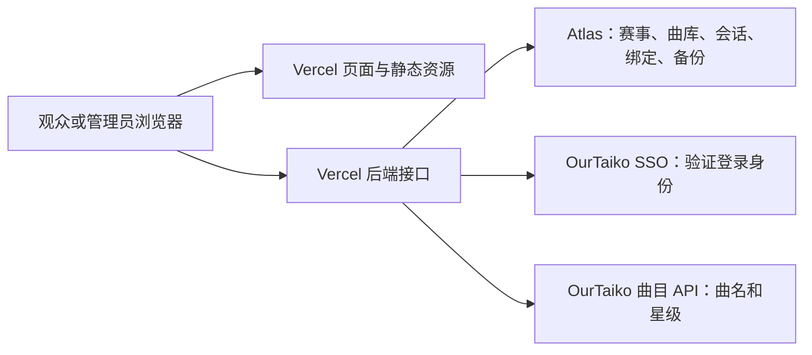

# HachiCats 维护手册

最后核对：2026-09-24。本文以同一提交中的代码为依据；线上环境变量、账号权限和赛事进度在实际维护时重新核对。文档不保存凭证、真实指定曲或当前比分。

## 1. 生产环境与已知边界

| 项目 | 当前约定 |
| --- | --- |
| 赛事 | 第一届八猫杯；暹罗、狸花、布偶三组，各 16 人、16 场（含季军赛） |
| 网站 | `https://hachicats.ourtaiko.org` |
| 仓库 / 发布分支 | `KirisameVanilla/HachiCats` / `main` |
| 托管 | Vercel 项目 `vanillaaaa/hachicats`，Node.js 24，函数区域 `hnd1` |
| 生产构建 | `vercel.json` → `npm run build:server` → `next build --webpack`，产物 `.next` |
| 数据库 | MongoDB Atlas `OurTaiko` 集群，数据库 `hachicats`，东京区域 |
| SSO | `https://sso.ourtaiko.org`，Application 名称 `HachiCats` |
| 正式回调 | `https://hachicats.ourtaiko.org/api/auth/callback` |
| 当前记录的管理员名单 | `kirisamevanilla,grace0512,Touka16`；以生效部署的环境变量为准 |

SSO 继续运行在原来的服务上。HachiCats 原有的 1Panel / Docker 服务已经退役；不要按仓库里保留的 `Dockerfile` / `compose.yaml` 把本站重新部署回旧服务器。它们不是现行发布入口，旧 SQLite / D1 适配器仍用于本地与兼容场景。

**已上线：** 选曲和 Ban、生成比赛曲目、录分、总分判胜、自动晋级、A/B 台并行比赛、轮空、整届重置及重置前备份。16 进 8、8 进 4 中 rating 低于对手至少 0.50 的选手显示先攻标记。

**尚未实现：** 独立的赛前「公布决赛曲 / 季军曲」按钮、网页曲库编辑器、网页管理员编辑器、备份恢复按钮、单场赛果撤销 / 改判、完整操作审计日志。讨论过这些功能不代表已经上线。

## 2. 前后端如何部署

Next.js 按路由和模块依赖生成构建结果，Vercel 按其框架集成部署。`app/api` 中的动态 `route.ts` 接口运行在 Vercel Functions；客户端组件及依赖生成浏览器 JavaScript，静态资源通过 CDN 提供。页面也可能包含构建时生成的 HTML，不能简单认为所有页面文件都只在浏览器执行。

`lib` 本身不代表后端。模块是否进入浏览器取决于导入关系。私有曲库读取模块包含 `import 'server-only'`，避免误入客户端；`tests/song-boundaries.test.mjs` 检查前端依赖图。



浏览器通过同一域名请求 `/api/...`，不直接连接 MongoDB。管理员名单和数据库 / SSO 密钥在服务端读取，不能改成 `NEXT_PUBLIC_*` 或放进客户端 props / JSON 响应。

### 代码入口

| 文件 | 职责 |
| --- | --- |
| `app/page.tsx` | 观众页面、分组曲库、管理状态及比赛详情 |
| `components/player-manager.tsx` | 管理员编辑姓名 / rating、新增同组替补 |
| `lib/player-management.ts` | 首轮互换、替补、锁定规则与选手输入校验 |
| `components/match-editor.tsx` | 选曲、Ban、生成曲目、录分与轮空操作 |
| `components/reset-tournament.tsx` | 重置确认文字、旧版本与重复提交保护 |
| `components/use-song-catalog.ts` | 公开曲库读取，每 30 秒刷新 |
| `lib/tournament.ts` | 比赛结构、初始化、晋级、公开赛况过滤 |
| `lib/rules.ts` | 服务端动作校验、总分判定、不可重选曲目与机台约束 |
| `lib/store.ts` | 赛事读写、Origin 校验、错误响应与数据库入口 |
| `lib/database.ts` | 存储适配器接口 |
| `lib/runtime.ts` | Next.js 运行环境：Atlas 或本地 SQLite |
| `lib/runtime.cloudflare.ts` / `lib/sql-database.ts` | Vinext/D1 与 SQLite 适配 |
| `lib/mongodb.ts` | Atlas 连接池与集合读写 |
| `lib/auth.ts` / `lib/admins.ts` | SSO、会话、管理员身份绑定 |
| `lib/song-library.ts` | 曲库结构校验 |
| `lib/song-library.server.ts` | 按正式 / 演示赛事读取数据库曲库 |
| `lib/song-catalog.server.ts` | 获取曲名 / 星级，按比赛公布状态过滤指定曲 |
| `lib/songs.ts` | 可共享的类型、编号和展示函数，不含真实曲库 |
| `lib/reset-tournament.ts` | 先备份、再按 revision 重置赛事 |

### HTTP 接口

| 方法 / 路径 | 访问与用途 |
| --- | --- |
| `GET /api/tournament` | 公开赛况；未公布比赛的 picks、bans、scores 被过滤 |
| `GET /api/songs` | 36 首普通曲及符合公布条件的指定曲；返回 `catalog`、`pools`、刷新状态 |
| `GET /api/session` | 当前用户及管理员状态；不返回 token |
| `GET /api/health` | 数据库 ping；200 不代表 SSO、曲库文档或上游曲名接口一定正常 |
| `GET /api/matches/[id]` | 仅管理员；该场私有草稿、本组曲库、该场指定曲和赛事 revision |
| `POST /api/matches/[id]` | 仅管理员；`draft/start/save/finish/bye`，校验 Origin 和 revision |
| `POST /api/players` | 仅管理员；编辑资料 / 新增替补 / 首轮换人，校验 Origin 和赛事 revision |
| `POST /api/tournament/reset` | 仅管理员；确认文字、revision、完整备份及条件更新 |
| `GET /api/auth/login`、`GET /api/auth/callback` | 发起和完成 SSO 登录 |
| `POST /api/auth/logout` | 清理本站会话，并尝试撤销 SSO token |
| `POST /api/auth/demo` | 仅演示模式及 loopback 地址允许的本地管理入口 |

公开赛况与曲库响应、私有比赛详情成功响应使用 `Cache-Control: no-store`。新增接口不要把管理员响应放进公开缓存。

## 3. 数据归属与稳定编号

### Atlas 集合

| 集合 | 关键字段 / 行为 |
| --- | --- |
| `tournaments` | `_id: edition-1` 或 `demo`；`revision`；`body` 是 JSON 字符串，内部也有 revision，`rosters` 保存三组选手资料 |
| `song_libraries` | `_id` 同上；`version: 1`；原生对象 `pools`、`designated` |
| `admins` | `_id` 为配置中的用户名；`subject`、`issuer` 绑定已验证的 SSO 身份 |
| `sessions` | `_id` 为随机会话 ID；`body` 含会话数据；`expires` 为毫秒时间戳，`expiresAt` 为 MongoDB Date |
| `tournament_backups` | `_id` 为随机备份 ID；`tournamentId`、原 `revision/body`、`createdAt`、`actor` |

`admins` 不是另一份允许名单，`sessions` 也不是所有 SSO 用户的注册表。会话读取始终校验过期时间；`sessions_expiry` TTL 索引按 `expiresAt` 清理，不能只依赖异步 TTL 删除来判断登录有效。

比赛写入使用 `_id + previous revision` 条件更新，只有一位并发写入者成功。数据库外层 `revision` 与 `body` 内的 revision 必须同步。不要把 `song_libraries.version` 当比赛版本号：它目前是固定的数据结构版本。

### 选手

姓名、初始 seed、rating 在 MongoDB `tournaments/edition-1` 的 `body.rosters` 中。每场比赛的 a/b 只保存选手 ID 和位置 seed，读取时关联数据库当前资料。`data/players.json` 仅为一次性迁移 / 本地初始化资料，不再作为正式读取来源，也不进入浏览器依赖图。修改资料立即生效，无需部署。

选手资料、首轮位置和比赛进度共用赛事 revision，单文档 CAS 写入使换人、替补状态、资料和录分不会被并发旧请求覆盖。替补由「本组名册中未占首轮位置的选手」计算，已淘汰选手仍占原首轮位置，不会误入替补区。新增选手分配稳定 UUID，固定组别，先进入替补。已有选手只能编辑姓名与 rating，不能更改 ID / 组别 / 初始 seed。

2026-09-24 已将 48 位资料迁入现有 Atlas，并在 `tournament_backups` 留存完整迁移前文档（actor: `migration:database-players`）；当时 revision 从 11 增至 12，所有比赛内容不变。本版本提供管理前端与 API；功能通过 Git → Vercel 随代码发布，数据库迁移本身不部署代码。

迁移工具仅处理 `hachicats/edition-1`，不覆盖已迁入的名册。正式库缺少 rosters 时新版本拒绝服务，避免静默回退旧资料：

```sh
node --env-file=.data/migration/atlas.env scripts/migrate-players.mjs --apply
node --env-file=.data/migration/atlas.env scripts/migrate-players.mjs --verify
```

上述私有环境文件只存在于当前维护机，其他机器需通过平台 Secret 配置对应凭证。

报名资料中“社畜”已按主办方确认统一为“社畜桑”。数字昵称仍用字符串；rating 用数字，显示两位小数。

### 曲库

`pools` 按 `siamese/tabby/ragdoll` 分组，每组严格 12 个条目，每项为 `{ id, songID, difficultyIndex }`。内部 ID 按顺序为 `siamese-1` 至 `siamese-12` 等，不得重排或重新编号。`designated` 按组保存 `final` 和 `third`，值为 `{ songID, difficultyIndex }`。

`difficultyIndex` 1–5 分别为简单、普通、困难、魔王、里谱面；不使用 `ura` 布尔值。曲名和星级不存入这份配置，通过 `https://cdn.ourtaiko.org/api/cnsongs` 的 `song_name`、`level_${difficultyIndex}` 关联。

指定曲内部引用为 `special:<group>:final` 或 `special:<group>:third`，不携带真实曲名。读取旧赛事时会把旧的 `special:曲名` 分数引用正规化。

### 指定曲何时公开

目前公开条件是：**该场 `published=true`，且成绩条目中含指定曲引用**。管理员完成选曲 / Ban、生成曲目并点击「开始比赛」后，指定曲随该场公布；仅保存待开始比赛的草稿不会公开。轮空清空成绩，不因此公布指定曲。

管理员的比赛详情接口可以提前读取该场指定曲；不能给普通登录用户或观众返回整份 `designated`。前端曲库页目前仍显示现场公布提示，已公布曲名在对应比赛详情中展示；没有独立提前公布入口。

上游曲名缓存只有 30 秒，且按实例保存；曲库配置与可见性每次由数据库和当前赛况决定。上游不可用时，保留已有元数据或显示曲目编号 / 未知星级，不能把未公布配置作为兜底返回。录分校验不依赖上游曲名请求成功。

## 4. 配置与管理员维护

### Production 环境变量

| 变量 | 用途 / 约定 |
| --- | --- |
| `APP_ORIGIN` | `https://hachicats.ourtaiko.org`；影响写入来源检查和回调 |
| `DEMO_MODE` | `false` |
| `MONGODB_URI` | Secret；专用应用账号连接串，不能放进文档或日志 |
| `MONGODB_DB` | `hachicats` |
| `SSO_ISSUER` | `https://sso.ourtaiko.org` |
| `SSO_CLIENT_ID` / `SSO_CLIENT_SECRET` | 已登记的 HachiCats 客户端；密钥保存为 Secret |
| `ADMIN_USERNAMES` | 逗号分隔的 SSO 登录用户名，大小写准确 |

本地 `DATABASE_PATH` 用于 SQLite。`ADMIN_USERNAME` 仅为旧配置兼容；优先使用复数变量。两个管理员变量都缺失时，当前代码默认 `kirisamevanilla`；明确设置 `ADMIN_USERNAMES` 为空会禁用全部管理员。

Production 凭证不复制到 Preview。Vercel 缺少 MongoDB 配置时拒绝运行数据库操作，不回退到临时 SQLite；正式 Atlas 缺少赛事或曲库文档时需要明确初始化 / 导入，不能自动生成演示数据。

Atlas 使用专用应用账号 `hachicats_app`，仅有 `hachicats` 库读写权限。本次迁移已采用经授权的 `0.0.0.0/0` 网络规则适配 Vercel Hobby 动态出口，连接仍需 TLS 与数据库凭证。排障时先核对现有规则和目标集群，不要误删其他应用的网络配置或临时扩大账号权限。

### 添加或移除管理员

1. 在 Vercel 的 `hachicats → Settings → Environment Variables` 编辑 Production 的 `ADMIN_USERNAMES`。保留其余名字，用英文逗号追加或删除目标登录用户名。
2. 保存并重新部署 Production，使新环境变量生效。
3. 用户使用自己的 OurTaiko 账号登录；已登录用户刷新页面以重新读取权限。受保护接口会再次验证身份与有效名单。
4. 名单中的身份首次验证通过后，程序自动在 `admins` 建立用户名到 `(issuer, subject)` 的绑定，无需手工插入数据库。

SSO Application 的所有者、Django 工作人员 / 超级用户、OAuth Grants 均不等同于本站管理员。移除名单中的名字后，对应的旧绑定不再授予权限；如果同一身份仍由另一条有效绑定授权，仍有权限。

如果账号删除后同名重建，旧绑定不会自动转给新账号。遇到“名单中有名字但没权限”，先核对当前 SSO subject、issuer、大小写和部署配置。只有明确确认账号替换后，才按身份迁移处理；不要直接删除绑定来绕过保护。

## 5. 日常操作

### 编辑选手及换人

管理员登录后，在「赛事管理」选择组别，通过「选手资料」编辑姓名 / rating 或「新增替补选手」。姓名为 1～60 字，rating 为 0～100、最多两位小数。表单打开时记住赛事版本，期间任何赛事修改都会要求重新打开表单。

在「赛事对阵」管理视图中，首轮每场下方有上位 / 下位下拉框。选择同组另一名正赛选手会原子互换；选择替补则直接上场，原选手进入下方替补区。跨组换人不允许。仅未开赛、未公布、未录分、无胜者且未晋级的首轮位置允许变更；交换时双方比赛均须满足条件。受影响比赛的未使用选曲 / Ban / 曲目草稿会清空，重新选曲。后续轮次仍由赛果自动晋级。

### 更新曲库

网页目前没有编辑入口。正式配置在 Atlas `hachicats.song_libraries` 的 `edition-1` 文档中维护。修改前备份完整原文档到私有目录，确认目标组别、用途、`songID` 和 `difficultyIndex`，用 `parseSongLibrary` 校验完整候选配置。

保存配置后，下一次后端读取即可生效；观众通常随 30 秒刷新更新，管理员重新打开比赛以读取新曲库。无需重新部署。不能在已录分后随意改变稳定 ID 对应的曲目，否则已有成绩会被解释成另一首歌。

指定曲仍应只保存到数据库。真实配置不能进入 README、测试快照、种子脚本、错误信息或提交说明。旧 Git 历史 / 历史部署中可能已有过去配置；迁移不消除既有泄露。如需防范已看过旧源码的人，由主办方更换未提交过的新指定曲。

`import-song-library.mjs` 是一次性创建 / 核对工具，不是更新工具：仅允许 `edition-1`，已有内容不同时会拒绝覆盖。以下路径是占位路径，执行前替换为私有文件：

```sh
node --env-file=.data/private-atlas.env scripts/import-song-library.mjs .data/private-song-library.json --apply
node --env-file=.data/private-atlas.env scripts/import-song-library.mjs .data/private-song-library.json --verify
```

输入文件使用 `id` 字段，工具转换为 MongoDB `_id`；只含结构约定中的字段。实际内容不得作为文档示例。导入操作不修改赛事状态。

### 重置第一届赛事

入口：「主办方入口 / 赛事管理 → 第一届赛事维护 → 重置第一届赛事」。输入 `重置第一届八猫杯` 后点击「备份并重置赛事」。

重置三个组全部 48 场的选曲、Ban、成绩、轮空、胜者和晋级状态，恢复数据库名册前 16 位对应的初始对阵；新增选手仍为替补。保留选手资料、曲库、管理员绑定及会话。演示模式确认文字为 `重置演示赛事`，只操作 `demo`。

后端先保存完整原始赛事文档，再以原 revision 条件更新为当前 revision + 1。备份失败就不重置；竞态失败可能留下一条未用于重置的备份，但不会覆盖其他人刚录入的成绩。旧录分窗口提交会返回 409。网络中断时先重新读取赛况，不要假定失败而连续提交。

### 备份与恢复

重置快照不自动过期，但也不是定时备份或全库备份：迁移后它包含赛事进度及选手名册，不包含曲库、账号绑定及会话。恢复迁移前旧快照时必须合入当前 rosters，不能让旧快照删除现有选手资料。不要假定 Atlas 套餐已经提供自动备份。修改曲库、迁移或维护重要数据前，分别保存所需文档；文件放在被忽略的私有目录，权限设为 600，日志仅记录计数 / 哈希 / 版本。

**当前没有恢复脚本或恢复 API。** 下列是维护流程，不是已经实现的命令：

1. 确认用户要恢复的赛事和具体备份 ID，协调暂停录分；当前没有自动维护模式开关。
2. 读取目标备份，核对 `tournamentId`、结构、48 场比赛、稳定选手 / 曲目引用。
3. 读取并另行备份现在的完整赛事文档，保留回到恢复前状态的依据。
4. 用备份的比赛内容构建候选状态，通过当前 `hydrateTournament` / `tournamentState` 规范化；版本设为**当前 revision + 1**，更新时间设为恢复时间，不沿用备份旧版本。
5. 以 `_id + 当前 revision` 条件更新，并同时写入外层 revision 与 `body` 内 revision。发生冲突就停止，重新评估当前数据，不做无条件覆盖。
6. 读取数据库、公开接口和管理页面核对内容，再恢复录分。不要修改曲库、绑定或会话来“配合”恢复。

重新部署、重启函数或回滚代码都不会自动回滚 MongoDB。禁止通过删除 `tournaments/edition-1` 来重置 / 恢复。

## 6. 开发、验证与部署

### 本地隔离

[README](../README.md) 提供 Node / SQLite 的独立演示命令。必须同时清空 `MONGODB_URI`，因为它优先于 SQLite，`DEMO_MODE=true` 只改变文档键及演示行为。不要在挂着生产 MongoDB 的环境执行录分或重置测试。

原有 `npm run dev` / `npm run build` 通过 `scripts/run-framework.mjs` 选择 Vinext 路线；macOS 默认使用 Vite/Cloudflare 配置，本地 D1 位于 `.wrangler/state/v3/d1/`。需要这条路线时，配置 `.dev.vars`，并仅对**全新的库**初始化一次：

```sh
npm run build
node --import ./scripts/sites-env.mjs ./node_modules/wrangler/bin/wrangler.js d1 execute DB --local --config dist/server/wrangler.json --persist-to .wrangler/state --file drizzle/0000_panoramic_old_lace.sql
npm run dev
```

这条路线默认端口 5188，与 Next.js / SQLite 的演示数据独立。本地 SSO 可使用相邻 OurTaikoSSO 项目的开发服务，既有配置是 `http://127.0.0.1:8090`；演示管理不依赖它，正式账号不保证存在于本地 SSO。

### 验证矩阵

| 改动范围 | 相关验证 |
| --- | --- |
| 比赛规则 / 选手 / 曲库 / 公开数据 | `npm test`：含规则、选手、换人 / 替补 / 权限 / 并发 / 迁移、曲库和浏览器依赖边界 |
| 管理员配置与绑定 | `npm run test:admins`；需要时用测试身份走完整 SSO 流程 |
| SQLite / 存储适配 | `npm run test:storage` |
| 重置与备份 | `npm run test:reset`，使用临时 SQLite |
| 接口整体流程 | 本地 demo 启动后，`TEST_ORIGIN=http://127.0.0.1:5192 npm run test:api` |
| TypeScript / 生产产物 | `npm run typecheck`、`npm run build:server` |
| Vinext / D1 兼容 | `npm run build`；必要时验证本地 D1 运行流程 |
| UI | 手机 390px 视口、实际交互和控制台；不以构建通过代替浏览器检查 |
| 纯文档 | 核对代码事实、文件链接、命令脚本和差异；不启动服务或操作生产库 |

Atlas 适配器变更可运行下面的集成测试。优先使用隔离测试库；必须事先明确目标库。该脚本会写入唯一命名的临时记录，并仅删除本次创建的记录，不是纯只读检查：

```sh
node --env-file=.data/private-test-atlas.env tests/mongodb.test.mjs
```

不要让任何通用清理脚本删除不属于本次测试的文档或集合。

### 发布流程

1. 检查工作区和差异，保留用户改动；确认没有凭证、真实指定曲或私有备份被加入 Git。
2. 按改动范围验证；存储 / 权限变更保留私有的发布前状态快照，正常验收不修改正式比赛。
3. 提交并推送 `main`，使用现有 GitHub → Vercel 自动部署；不要随后再重复运行 `vercel --prod`。纯文档不额外发起手动部署；Git 集成仍可能自动构建，不要假定提交信息能跳过它。
4. 在 Vercel 核对对应 commit 的部署为 Ready，且正式域名已指向该版本。代码推送成功不等于上线成功。
5. 检查 `/api/health`、公开赛况、公开曲库、匿名管理拒绝、需要时的正常管理员页面；确认现有比赛与预期一致。指定曲相关改动还要检查公开 HTML / JavaScript / JSON 是否泄露。
6. 记录实际 commit、部署状态及验证结果。本地详细报告可放 `outputs/`，但它被忽略，不是持久项目知识的唯一存放处。

已登录官方 CLI 且项目已关联时，可用 `vercel ls hachicats --scope vanillaaaa` 和 `vercel inspect <实际部署URL> --scope vanillaaaa` 检查；新机器先核对连接的是哪个账号 / 项目，不复制其他机器的凭证。环境变量更改需要新部署才生效。

代码回滚只适用于仍与当前数据库兼容的版本。曲库迁移前的老代码可能继续读旧 JSON，不能把它当作数据库恢复方法。

## 7. 故障定位

| 现象 | 先检查什么 |
| --- | --- |
| 管理员名单中有名字但没权限 | 生效部署的 `ADMIN_USERNAMES`、大小写、SSO UserInfo、`admins` 的 issuer / subject；不是昵称或 SSO 工作人员标记 |
| 401 | 会话不存在、过期或 SSO token 无效；重新登录，检查 Cookie 与实际域名 |
| 403「请求来源不匹配」 | Origin 与 `APP_ORIGIN` 是否完全一致；是否混用 localhost / 127.0.0.1 / Vercel 预览域名 |
| 403「没有管理权限」 | 服务端名单与稳定身份绑定；不要用前端显示状态代替权限结论 |
| 409 | 别的管理员已保存或页面版本过旧；重新读取比赛，不能强制覆盖 |
| 503 / 数据库连接失败 | MongoDB Secret、数据库名、账号权限、Atlas 网络规则、服务端日志；不要输出连接串 |
| 健康检查正常但曲库 503 | `song_libraries/edition-1` 是否存在且满足 schema；health 只做 ping |
| 曲目显示编号或星级未知 | 上游曲目接口、songID、对应 level 字段与 30 秒缓存；不要编造难度 |
| 已部署但仍是旧内容 | 对应 commit 是否 Ready、生产域名 alias、浏览器是否刷新；数据库配置修改与代码部署分开检查 |
| 重置请求断线 | 先读当前 revision 和赛况，再查备份；存在备份不一定代表重置成功 |
| 指定曲未出现在观众页面 | 该场是否真正开始 / 公布且成绩含指定曲；当前没有独立提前公布按钮 |

错误响应只应给出适合用户查看的信息。服务端不要直接打印私有文档、完整 SSO 异常载荷或 token。

## 8. 历史迁移与资料保存

`export-sqlite.mjs` 与 `import-mongodb.mjs` 保留用于旧库迁移。它们只覆盖 `tournaments/admins/sessions`，不包含后来增加的 `song_libraries` 和 `tournament_backups`，所以不能当作当前完整备份方案。导入会检查冲突并拒绝覆盖，不是通用恢复工具。

本次维护机的历史快照位于 `.data/migration/`，曲库迁移快照位于 `.data/migration/song-library/`，验收记录位于 `outputs/`。这些目录不随 Git 或 Vercel 分发；其他机器可能不存在。查不到时先寻找已有私有备份，不能从 demo 推断正式数据。

旧服务器上的本站容器、镜像、项目目录已清理，保留过退役归档；不要清理或改动 SSO、PostgreSQL、OpenResty 等其他服务。新的日常维护不需要 SSH 到旧服务器部署 HachiCats。

## 9. 文档更新约定与参考

改动数据结构、部署入口、环境变量、权限、公布条件、重置或恢复行为时，同步更新本文和相关测试。`README` 保留快速入口，`AGENTS.md` 保留维护约定，具体流程以本文为主，避免重复产生冲突版本。

- [Next.js Route Handlers](https://nextjs.org/docs/app/getting-started/route-handlers)
- [Next.js on Vercel](https://vercel.com/docs/frameworks/full-stack/nextjs)
- [Vercel 环境变量](https://vercel.com/docs/environment-variables)
- [Vercel Git 集成](https://vercel.com/docs/git)
