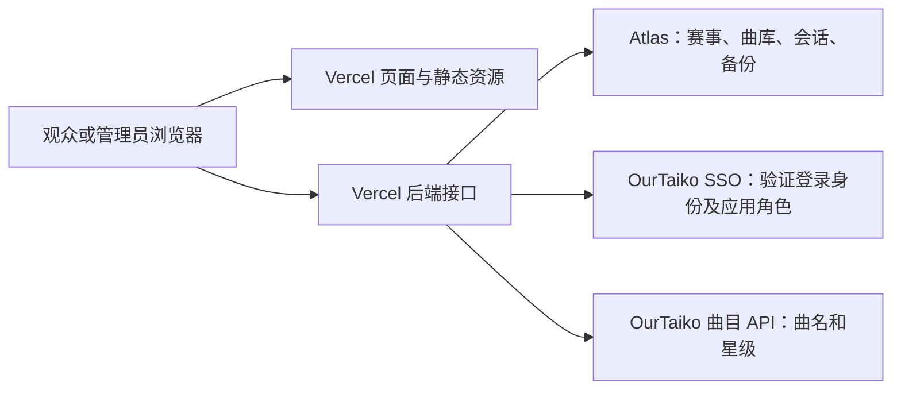

# HachiCats 维护手册

最后核对：2026-09-28。本文以同一提交中的代码为依据；线上环境变量、账号权限和赛事进度在实际维护时重新核对。文档不保存凭证、真实指定曲或当前比分。

## 1. 生产环境与已知边界

| 项目 | 当前约定 |
| --- | --- |
| 赛事 | 第一届八猫杯；暹罗、狸花、布偶三组，各 16 人、16 场（含季军赛） |
| 网站 | `https://hachicats.ourtaiko.org` |
| 仓库 / 发布分支 | `KirisameVanilla/HachiCats` / `main` |
| 托管 | Vercel 项目 `vanillaaaa/hachicats`，Node.js 24，函数区域 `hnd1` |
| 生产构建 | `vercel.json` → `npm run build` → `next build --webpack`，产物 `.next` |
| 数据库 | MongoDB Atlas `OurTaiko` 集群，数据库 `tournaments`，东京区域 |
| SSO | `https://sso.ourtaiko.org`，Application 名称 `HachiCats` |
| 正式回调 | `https://hachicats.ourtaiko.org/api/auth/callback` |
| 管理员权限来源 | SSO Client roles，选择 HachiCats Application；按稳定用户 ID 授权 |

SSO 继续运行在原来的服务上。HachiCats 原有的 1Panel / Docker 服务已经退役，仓库已移除 Docker 构建、Compose 和忽略配置，以及专用于容器部署的 Next.js standalone 输出与启动命令。现行发布入口是 Vercel 的 `npm run build`；SQLite 适配器仅用于本地演示与测试。Vinext / Cloudflare / D1 路线及其脚本、Drizzle 配置已移除。

**已上线：** 选曲和 Ban、生成比赛曲目、录分、总分判胜、自动晋级、A/B 台并行比赛、轮空、整届重置及重置前备份。16 进 8、8 进 4 中 rating 低于对手至少 0.50 的选手显示先攻标记。

**已存档（本分支，尚未发布）：** 赛事于 2026-09-27 结束。`/hachicats/20260927` 改为静态页面，从 `data/archive/hachicats-20260927.json` 渲染最终赛果，不再轮询接口，也不再提供管理 tab。存档由 `node scripts/archive-tournament.mjs https://tournaments.ourtaiko.org hachicats 20260927` 从公开接口生成，只含已公布数据；生成前脚本会校验全部场次已公布并结束。Atlas 中的赛事、曲库和备份保持不变，后端接口及管理组件暂时保留。

**尚未实现：** 独立的赛前「公布决赛曲 / 季军曲」按钮、网页曲库编辑器、本站管理员编辑器（管理员在 SSO 后台维护）、备份恢复按钮、单场赛果撤销 / 改判、完整操作审计日志。讨论过这些功能不代表已经上线。

## 2. 前后端如何部署

Next.js 按路由和模块依赖生成构建结果，Vercel 按其框架集成部署。`app/api` 中的动态 `route.ts` 接口运行在 Vercel Functions；客户端组件及依赖生成浏览器 JavaScript，静态资源通过 CDN 提供。页面也可能包含构建时生成的 HTML，不能简单认为所有页面文件都只在浏览器执行。

`lib` 本身不代表后端。模块是否进入浏览器取决于导入关系。私有曲库读取模块包含 `import 'server-only'`，避免误入客户端；`tests/song-boundaries.test.mjs` 检查前端依赖图。



浏览器通过同一域名请求 `/api/...`，不直接连接 MongoDB。管理员角色在服务端实时查询，数据库 / SSO 密钥仅在服务端读取，不能改成 `NEXT_PUBLIC_*` 或放进客户端 props / JSON 响应。

### 代码入口

| 文件 | 职责 |
| --- | --- |
| `app/hachicats/20260927/page.tsx` | 静态赛果存档：赛事总结、赛事对阵、分组曲库（含已公布指定曲）、赛事指南四个 tab 及只读比赛详情；不请求赛事接口 |
| `data/archive/hachicats-20260927.json` | 八猫杯最终公开赛况与曲目（revision 168）；`scripts/archive-tournament.mjs` 生成，`tests/archive.test.mjs` 校验 |
| `app/login/page.tsx` / `components/login-page.tsx` | 独立登录页、账号状态、退出及本地演示入口 |
| `components/player-manager.tsx` | 管理员编辑姓名 / rating、新增同组替补 |
| `lib/player-management.ts` | 首轮互换、替补、锁定规则与选手输入校验 |
| `components/match-editor.tsx` | 选曲、Ban、生成曲目、录分与轮空操作 |
| `components/reset-tournament.tsx` | 重置确认文字、旧版本与重复提交保护 |
| `components/use-song-catalog.ts` | 公开曲库读取，每 30 秒刷新（目前无页面使用） |
| `lib/tournament.ts` | 比赛结构、初始化、晋级、公开赛况过滤 |
| `lib/rules.ts` | 服务端动作校验、总分判定、不可重选曲目与机台约束 |
| `lib/store.ts` | 赛事读写、Origin 校验、错误响应与数据库入口 |
| `lib/database.ts` | 存储适配器接口 |
| `lib/runtime.ts` | Next.js 运行环境：Atlas 或本地 SQLite |
| `lib/sql-database.ts` | SQLite 适配 |
| `lib/mongodb.ts` | Atlas 连接池与集合读写 |
| `lib/auth.ts` / `lib/sso-session.ts` | OIDC、会话、本应用 token 验证与实时 ClientRole |
| `lib/song-library.ts` | 曲库结构校验 |
| `lib/song-library.server.ts` | 按正式 / 演示赛事读取数据库曲库 |
| `lib/song-catalog.server.ts` | 获取曲名 / 星级，按比赛公布状态过滤指定曲 |
| `lib/songs.ts` | 可共享的类型、编号和展示函数，不含真实曲库 |
| `lib/reset-tournament.ts` | 先备份、再按 revision 重置赛事 |

### HTTP 接口

| 方法 / 路径 | 访问与用途 |
| --- | --- |
| `GET /api/tournaments/hachicats/20260927` | 公开赛况；未公布比赛的 picks、bans、scores 被过滤 |
| `GET /api/tournaments/hachicats/20260927/songs` | 36 首普通曲及符合公布条件的指定曲；返回 `catalog`、`pools`、刷新状态 |
| `GET /api/tournaments` | 公开赛事目录，不包含数据键、权限策略或私有曲库 |
| `GET /api/tournaments/hachicats/20260927/access` | 当前账号对本赛事的 `canManage`，未登录为 false；SSO 故障返回 503 |
| `GET /api/session` | 当前用户及管理员状态；不返回 token |
| `GET /api/health` | 数据库 ping；200 不代表 SSO、曲库文档或上游曲名接口一定正常 |
| `GET /api/tournaments/hachicats/20260927/matches/[id]` | 仅管理员；该场私有草稿、本组曲库、该场指定曲和赛事 revision |
| `POST /api/tournaments/hachicats/20260927/matches/[id]` | 仅管理员；`draft/start/save/finish/bye`，校验 Origin 和单场 matchRevision；整届 revision 保留 CAS 与旧客户端兼容 |
| `POST /api/tournaments/hachicats/20260927/players` | 仅管理员；编辑资料 / 新增替补 / 首轮换人，校验 Origin 和赛事 revision |
| `POST /api/tournaments/hachicats/20260927/reset` | 仅管理员；确认文字、revision、完整备份及条件更新 |
| `GET /api/auth/login`、`GET /api/auth/callback` | 发起和完成 SSO 登录 |
| `POST /api/auth/logout` | 清理本站会话，并尝试撤销 SSO token |
| `POST /api/auth/demo` | 仅演示模式及 loopback 地址允许的本地管理入口 |

旧 `/api/tournament`、`/api/songs`、`/api/matches/[id]`、`/api/players`、`/api/tournament/reset` 继续作为八猫杯固定别名；请求体或 query 不能改变其归属。新页面只调用赛事作用域路由。

公开赛况与曲库响应、私有比赛详情成功响应及错误响应使用 `Cache-Control: no-store`。新增接口不要把管理员响应放进公开缓存。

## 3. 数据归属与稳定编号

### Atlas 集合

| 集合 | 关键字段 / 行为 |
| --- | --- |
| `tournaments` | schemaVersion 3 元信息：`_id`、`revision`、`updatedAt`、groups 和记录计数；没有 body |
| `tournament_participants` | 原生选手字段；`tournamentId + playerId` 唯一，rosterOrder 保留名册顺序 |
| `matches` | 原生比赛及 scores / picks / bans；`tournamentId + matchId` 唯一，matchOrder 保留数组顺序 |
| `song_libraries` | `_id` 同上；`version: 1`；原生对象 `pools`、`designated` |
| `admins` | 历史身份绑定，仅留存回退，不再读取或写入，不授予权限 |
| `sessions` | `_id` 为随机会话 ID；`body` 含会话数据；`expires` 为毫秒时间戳，`expiresAt` 为 MongoDB Date |
| `tournament_backups` | `_id` 为随机备份 ID；`tournamentId`、原 `revision/body`、`createdAt`、`actor` |

`admins` 不参与当前认证，`sessions` 也不是所有 SSO 用户的注册表。会话读取始终校验过期时间；`sessions_expiry` TTL 索引按 `expiresAt` 清理，不能只依赖异步 TTL 删除来判断登录有效。

比赛写入使用 `_id + previous revision` 条件更新，单次 CAS 只有一位并发写入者成功。新客户端同时发送打开详情时的 `matchRevision`（`match.revision ?? 0`）：本场未变化时，其他场次更新不再要求重开详情；后端读取最新赛况、重新校验机台 / 选曲 / 晋级规则再保存，写入竞态最多尝试四次。同场变更仍返回 409，不覆盖其他人的成绩。旧客户端未发送 `matchRevision` 时继续按整届 revision 检查，需要刷新网页一次才能使用新逻辑。schemaVersion 3 仅在赛事元信息中持久化全局 revision，repository 重组 API 状态时带回该版本；旧 body 格式仍要求内外版本一致。单场 `match.revision` 在本场保存、参赛选手资料 / 位置变更以及晋级带来选手变化时，更新为此次整届 revision；未变的比赛保持原值，旧文档缺省为 0，无需迁移。重置会把全部场次版本设为新整届 revision，即使空白场次也会让旧编辑窗口失效。不要把 `song_libraries.version` 当比赛版本号：它目前是固定的数据结构版本。

### 选手

姓名、初始 seed、rating 在 MongoDB `tournament_participants` 中，以 tournamentId 关联赛事。每场比赛的 a/b 只保存选手 ID 和位置 seed，读取时关联数据库当前资料。`data/players.json` 仅为一次性迁移 / 本地初始化资料，不再作为正式读取来源，也不进入浏览器依赖图。修改资料立即生效，无需部署。

选手资料、首轮位置和比赛进度共用赛事 revision；Atlas 通过整届 CAS 和跨集合事务保证换人、替补、资料和录分不会被并发旧请求覆盖。替补由「本组名册中未占首轮位置的选手」计算，已淘汰选手仍占原首轮位置，不会误入替补区。新增选手分配稳定 UUID，固定组别，先进入替补。已有选手只能编辑姓名与 rating，不能更改 ID / 组别 / 初始 seed。

2026-09-24 已将 48 位资料迁入现有 Atlas，并在 `tournament_backups` 留存完整迁移前文档（actor: `migration:database-players`）；当时 revision 从 11 增至 12，所有比赛内容不变。本版本提供管理前端与 API；功能通过 Git → Vercel 随代码发布，数据库迁移本身不部署代码。

迁移工具仅处理 `tournaments/hachicats-20260927`，不覆盖已迁入的名册。正式库缺少 rosters 时新版本拒绝服务，避免静默回退旧资料：

```sh
node --env-file=.data/migration/atlas.env scripts/migrate-players.mjs --apply
node --env-file=.data/migration/atlas.env scripts/migrate-players.mjs --verify
```

上述私有环境文件只存在于当前维护机，其他机器需通过平台 Secret 配置对应凭证。

报名资料中“社畜”已按主办方确认统一为“社畜桑”。数字昵称仍用字符串；rating 用数字，显示两位小数。

### 曲库

`pools` 按 `siamese/tabby/ragdoll` 分组，每组严格 12 个条目，每项为 `{ id, songID, difficultyIndex }`。内部 ID 按顺序为 `siamese-1` 至 `siamese-12` 等，不得重排或重新编号。`designated` 按组保存 `final` 和 `third`，值为 `{ songID, difficultyIndex }`。

`difficultyIndex` 1–5 分别为简单、普通、困难、魔王、里谱面；不使用 `ura` 布尔值。曲名和星级不存入这份配置，通过 `https://cdn.ourtaiko.org/api/cnsongs` 的 `song_name`、`level_${difficultyIndex}` 关联。

指定曲内部引用为 `special:<group>:final` 或 `special:<group>:third`，不携带真实曲名。读取旧赛事时会把旧的 `special:曲名` 分数引用正规化。

### 指定曲何时公开

目前公开条件是：**该场 `published=true`，且成绩条目中含指定曲引用**。管理员完成选曲 / Ban、生成曲目并点击「开始比赛」后，指定曲随该场公布；仅保存待开始比赛的草稿不会公开。轮空清空成绩，不因此公布指定曲。

管理员的比赛详情接口可以提前读取该场指定曲；不能给普通登录用户或观众返回整份 `designated`。前端曲库页目前仍显示现场公布提示，已公布曲名在对应比赛详情中展示；没有独立提前公布入口。

上游曲名缓存只有 30 秒，且按实例保存；曲库配置与可见性每次由数据库和当前赛况决定。上游不可用时，保留已有元数据或显示曲目编号 / 未知星级，不能把未公布配置作为兜底返回。录分校验不依赖上游曲名请求成功。

## 4. 配置与管理员维护

### Production 环境变量

| 变量 | 用途 / 约定 |
| --- | --- |
| `APP_ORIGIN` | `https://hachicats.ourtaiko.org`；影响写入来源检查和回调 |
| `DEMO_MODE` | `false` |
| `MONGODB_URI` | Secret；专用应用账号连接串，不能放进文档或日志 |
| `MONGODB_DB` | `tournaments` |
| `SSO_ISSUER` | `https://sso.ourtaiko.org` |
| `SSO_CLIENT_ID` / `SSO_CLIENT_SECRET` | 已登记的 HachiCats 客户端；密钥保存为 Secret |
| SSO 后台的接口权限 | HachiCats 仅开启“允许网站令牌查询和撤销”；游戏、资料查询无需开启 |

本地 `DATABASE_PATH` 用于 SQLite。`ADMIN_USERNAMES` / `ADMIN_USERNAME` 已不再读取，也没有默认管理员。内部请求复用现有 `SSO_CLIENT_ID` / `SSO_CLIENT_SECRET`，不新增服务凭据。

Production 凭证不复制到 Preview。Vercel 缺少 MongoDB 配置时拒绝运行数据库操作，不回退到临时 SQLite；正式 Atlas 缺少赛事或曲库文档时需要明确初始化 / 导入，不能自动生成演示数据。

Atlas 原专用应用账号为 `hachicats_app`；切换数据库名后，应确认所用账号具有 `tournaments` 库读写权限（本次代码修改未更改 Atlas 授权）。本次迁移已采用经授权的 `0.0.0.0/0` 网络规则适配 Vercel Hobby 动态出口，连接仍需 TLS 与数据库凭证。排障时先核对现有规则和目标集群，不要误删其他应用的网络配置或临时扩大账号权限。

### 添加或移除管理员

1. 在 OurTaiko SSO 后台进入 **Client roles**，选择用户及 **HachiCats** Application。
2. 勾选 **Is admin** 并保存即授权；取消勾选或删除该角色即撤权。不需要修改 Vercel 配置或重新部署。
3. 后端每次管理请求用当前 access token 调用 `/internal/v1/web/introspect`，核对返回 ID 与本站 session 的 sub 一致，并严格读取布尔值 isAdmin。
4. 已打开页面可刷新以更新按钮显示；服务端角色变化在下一次请求生效，已发出的请求不追溯取消。

SSO Application 所有者、Django 工作人员 / 超级用户、其他 Application 的 ClientRole 均不授予本站管理员权限。
同名重建账号拥有不同用户 ID，不继承旧角色。OIDC 登录仍使用授权码、state、nonce、PKCE；登录本身不等于管理员。
SSO 超时、配置错误、格式异常或身份不符均返回 503 并拒绝操作，不回退旧名单；明确的失效 token 清理本站 session。

### 从旧名单切换

先备份当前 Atlas 赛事、曲库及旧绑定，按生效部署的允许名单和 `(issuer, subject)` 绑定核对 SSO 用户，
仅将对应用户添加到 HachiCats Client roles，并开启该 Application 的网站令牌接口权限。
先配置 SSO，再通过 main → Vercel 发布本版本；确认 Ready 后验证真实 OIDC 登录、普通用户拒绝和角色即时撤销。
测试仅读取管理详情，不重置、录分或修改正式赛事；前后比对赛事、曲库及 revision。
旧 `admins` 文档保持原样作为回退记录，运行时代码已删除其读写方法。旧 ADMIN_USERNAMES 变量可以删除。
若需回退应用版本，应同时恢复旧环境名单；不要回滚或覆盖赛事库。后续管理员变化以 SSO 为准，旧名单不再自动同步。
私有备份和验证结果位于执行机器忽略目录 `.data/sso-migration/`，不随 Git 分发。

## 5. 日常操作

> 本节描述比赛期间的实时管理流程。八猫杯已存档，当前页面不再挂载这些管理界面；以下内容仅供复用该系统时参考。

「赛事对阵」的「正在进行」位于分组切换上方，汇总所有组的进行中比赛，按 A / B 台排序并标明组别。切换分组只影响下方对阵图和替补名单，进行中比赛保持全局展示；点击任意组的比赛可直接查看详情或管理，曲目按该场比赛所属组显示。

本版本页面将「赛事管理」与「赛事对阵」「分组曲库」「赛事指南」并列；管理 tab 放置选手资料和赛事维护工具。未登录或无权限时只显示状态及 `/login` 链接。页头「登录 / 账号」进入独立 `/login`，OurTaiko 登录按钮、本地演示入口及账号退出在该页提供。登录成功返回赛事管理 tab（`/hachicats/20260927?manage=1`）；登录失败返回 `/login?authError=...` 并显示可重试提示。原 SSO 回调、鉴权及写入规则保持不变。管理员在对阵页仍可切换观众视图。

两台并行录分时，分别在比赛详情选择 A 台和 B 台。另一场的保存不会清空本场输入或要求刷新；若提示「本场比赛或参赛选手已更新」，才需要重新打开本场。同场之外的选手管理与整届重置仍使用整届 revision。

比赛结果确认成功（含轮空晋级）后，比赛详情窗口自动关闭，并提示「结果已确认，对阵图已更新」。保存草稿、开始比赛和保存比分仍保留详情窗口，方便继续操作；提交失败时也保留窗口与错误提示。

对阵图的决赛统一标为「冠军赛」，桌面卡片上方增加与季军赛一致的标题和奖杯图标，卡片在桌面和手机上均显示该字样。管理员重新打开已结束比赛时，与观众共用只读比赛记录：展示胜者、双方选曲、各自 Ban 的对方曲目、全部逐曲比分（含指定曲及加赛）和总分。选曲列表的「被对方 Ban」只标记该选手被禁用的选择，双方同名曲不会一起标记。未公布比赛继续隐藏选曲、Ban 和比分。这里的「未公布」指 `published=false`；「开始比赛」会将该场设为已公布，管理员有权限提前读取本场私有详情。公开赛事接口会在服务端移除未公布场次的选曲、Ban 和比分，公开曲库仅加入已公布场次的指定曲对应关系。`tests/songs.test.mjs` 用独立临时 SQLite 检查三组冠军赛 / 季军赛的全部 64 种公布组合，以及匿名、无效会话、普通账号访问管理详情时的拒绝行为；所有外部请求均使用测试替身。

### 赛事总结

「赛事总结」是第一个页签，也是默认首页，可通过 `/hachicats/20260927?view=summary` 直接打开；`/hachicats/20260927?view=bracket` 可直接进入对阵页。顶部的冠军区不受分组切换影响，按「布偶组、狸花组、暹罗组」一行三列排列（含手机端），从各组已公布并已结束的冠军赛读取胜者；未决出时显示占位。冠军卡可点击查看赛果，下面的统计仍可按组切换。仅使用公开赛况和公开曲库，不增加数据库写入或私有数据接口。统计范围为已公布、已确认赛果、双方选手齐全且所有比分完整的比赛，排除草稿、进行中和轮空；赛事未结束时展示截至当前的结算结果。

- 曲目排名支持「选用次数」和「Ban 次数」切换。原始选曲包含被 Ban 的选择，双方选择同一首计两次；双方 Ban 同一首也计两次。随机补曲、指定曲、加赛不额外算作主动选曲。未被选择的普通曲库曲目保留零次数；未公布的指定曲不进入统计。
- 每条曲目同时展示选用数、Ban 数和实际游玩场次。默认折叠，点击展开最高分排行，再次点击收起。每位选手仅保留该曲最高分，同分并列；点击分数可打开来源比赛。同一 `songID` 和 `difficultyIndex` 的曲目别名合并，不同难度分别统计。
- 最大 Rating 逆转展示低 rating 方获胜且双方差距最大的比赛；最大差距并列时全部展示。使用赛事选手资料中的报名 rating v2，并按两位小数比较。
- 「毫厘之争」展示总分差严格小于 2,000 的所有比赛，包含指定曲和加赛成绩，按分差升序排列；2,000 分不纳入。卡片可打开比赛详情。

纯本地回归测试：`node tests/tournament-summary.test.mjs`（已加入 `npm test`），覆盖原始选择 / Ban 计数、最高分去重、并列、曲目别名 / 难度、组别隔离、隐藏数据、状态过滤和 2,000 分边界。UI 验证包含五个页签、手机 390px、排名切换、曲目展开 / 收起和来源比赛详情。

### 选曲与 Ban 的作用范围

Ban 只移除对方所选的一首，不全局删除另一方保留的同名曲。比如 A 选 1、2，B 选 2、3；A Ban B 的 2，B Ban A 的 1，最终保留 A 的 2 和 B 的 3，无需随机补曲。前端生成与后端录分校验共用 `retainedSongs`。仅双方最终保留同一首时才去重并从未禁用、未入选的普通曲中随机补足两首；补曲和加赛仍排除本场 Ban 过的曲目。修复不会自动改写既有场次的选曲、曲目表或成绩。

### 编辑选手及换人

管理员登录后，在「赛事管理」选择组别，通过「选手资料」编辑姓名 / rating 或「新增替补选手」。姓名为 1～60 字，rating 为 0～100、最多两位小数。表单打开时记住赛事版本，期间任何赛事修改都会要求重新打开表单。

在「赛事对阵」管理视图中，点击首轮比赛，在比赛详情顶部的「参赛选手 / 替补」中使用上位 / 下位下拉框；对阵图卡片不再展示换人控件。选择同组另一名正赛选手会原子互换；选择替补则直接上场，原选手进入下方替补区。跨组换人不允许。仅未开赛、未公布、未录分、无胜者且未晋级的首轮位置允许变更；交换时双方比赛均须满足条件。受影响比赛的未使用选曲 / Ban / 曲目草稿会清空，重新选曲。换人成功后保留详情窗口，更新双方选手并重新开始选曲；使用打开详情时的 revision，旧版本提交会被拒绝。后续轮次仍由赛果自动晋级。

### 更新曲库

网页目前没有编辑入口。正式配置在 Atlas `tournaments.song_libraries` 的 `hachicats-20260927` 文档中维护。修改前备份完整原文档到私有目录，确认目标组别、用途、`songID` 和 `difficultyIndex`，用 `parseSongLibrary` 校验完整候选配置。

保存配置后，下一次后端读取即可生效；观众通常随 30 秒刷新更新，管理员重新打开比赛以读取新曲库。无需重新部署。不能在已录分后随意改变稳定 ID 对应的曲目，否则已有成绩会被解释成另一首歌。

指定曲仍应只保存到数据库。真实配置不能进入 README、测试快照、种子脚本、错误信息或提交说明。旧 Git 历史 / 历史部署中可能已有过去配置；迁移不消除既有泄露。如需防范已看过旧源码的人，由主办方更换未提交过的新指定曲。

`import-song-library.mjs` 是一次性创建 / 核对工具，不是更新工具：仅允许 `hachicats-20260927`，已有内容不同时会拒绝覆盖。以下路径是占位路径，执行前替换为私有文件：

```sh
node --env-file=.data/private-atlas.env scripts/import-song-library.mjs .data/private-song-library.json --apply
node --env-file=.data/private-atlas.env scripts/import-song-library.mjs .data/private-song-library.json --verify
```

输入文件使用 `id` 字段，工具转换为 MongoDB `_id`；只含结构约定中的字段。实际内容不得作为文档示例。导入操作不修改赛事状态。

### 重置第一届赛事

入口：「赛事管理 → 第一届赛事维护 → 重置第一届赛事」。输入 `重置第一届八猫杯` 后点击「备份并重置赛事」。

重置三个组全部 48 场的选曲、Ban、成绩、轮空、胜者和晋级状态，恢复数据库名册前 16 位对应的初始对阵；新增选手仍为替补。保留选手资料、曲库、管理员绑定及会话。演示模式确认文字为 `重置演示赛事`，只操作 `demo`。

Atlas 后端在同一事务中保存完整赛事 snapshot，再以原 revision 条件更新为当前 revision + 1，并提交全部场次。备份失败就不重置；事务冲突不会覆盖其他人刚录入的成绩。本地 SQLite 仍可能留下一条未用于重置的备份。旧录分窗口提交会返回 409。网络中断时先重新读取赛况，不要假定失败而连续提交。

### 备份与恢复

重置快照不自动过期，但也不是定时备份或全库备份：迁移后它包含赛事进度及选手名册，不包含曲库、账号绑定及会话。恢复迁移前旧快照时必须合入当前 rosters，不能让旧快照删除现有选手资料。不要假定 Atlas 套餐已经提供自动备份。修改曲库、迁移或维护重要数据前，分别保存所需文档；文件放在被忽略的私有目录，权限设为 600，日志仅记录计数 / 哈希 / 版本。

**当前没有恢复脚本或恢复 API。** 下列是维护流程，不是已经实现的命令：

1. 确认用户要恢复的赛事和具体备份 ID，协调暂停录分；当前没有自动维护模式开关。
2. 读取目标备份，核对 `tournamentId`、结构、48 场比赛、稳定选手 / 曲目引用。
3. 读取并另行备份现在的完整赛事文档，保留回到恢复前状态的依据。
4. 用备份的比赛内容构建候选状态，通过当前 `hydrateTournament` / `tournamentState` 规范化；版本设为**当前 revision + 1**，所有场次的 `match.revision` 同样设为该新版本，更新时间设为恢复时间，不沿用备份旧版本。
5. 以 `_id + 当前 revision` 条件更新，并同时写入外层 revision 与 `body` 内 revision。发生冲突就停止，重新评估当前数据，不做无条件覆盖。
6. 读取数据库、公开接口和管理页面核对内容，再恢复录分。不要修改曲库、绑定或会话来“配合”恢复。

重新部署、重启函数或回滚代码都不会自动回滚 MongoDB。禁止通过删除 `tournaments/hachicats-20260927` 来重置 / 恢复。

## 6. 开发、验证与部署

### 本地隔离

[README](../README.md) 提供 Node / SQLite 的独立演示命令。必须同时清空 `MONGODB_URI`，因为它优先于 SQLite，`DEMO_MODE=true` 只改变文档键及演示行为。不要在挂着生产 MongoDB 的环境执行录分或重置测试。

本地 SSO 可使用相邻 OurTaikoSSO 项目的开发服务，既有配置是 `http://127.0.0.1:8090`；演示管理不依赖它，正式账号不保证存在于本地 SSO。

### 验证矩阵

| 改动范围 | 相关验证 |
| --- | --- |
| 比赛规则 / 选手 / 曲库 / 公开数据 | `npm test`：含规则、选手、换人 / 替补 / 权限 / 并发 / 迁移、曲库、浏览器依赖边界与独立 SQLite 单场并发 API 测试（强制 CAS 碰撞、同场冲突、机台占用、重置 / 换人 / 晋级失效） |
| SSO 应用角色与实时撤权 | `npm run test:admins`；需要时用测试身份走完整 SSO 流程 |
| SQLite / 存储适配 | `npm run test:storage` |
| 重置与备份 | `npm run test:reset`，使用临时 SQLite |
| 接口整体流程 | 本地 demo 启动后，`TEST_ORIGIN=http://127.0.0.1:5192 npm run test:api` |
| TypeScript / 生产产物 | `npm run typecheck`、`npm run build` |
| 赛果存档 | `node tests/archive.test.mjs`（已含于 `npm test`）；确认存档页面在构建输出中为静态（○） |
| UI | 手机 390px 视口、五个 tab、独立 `/login`、登录错误 / 退出、比赛详情换人及草稿清空；管理员 / 观众已结束比赛的逐曲记录运行 `node tests/match-summary.test.mjs`；检查控制台，不以构建通过代替浏览器检查 |
| 纯文档 | 核对代码事实、文件链接、命令脚本和差异；不启动服务或操作生产库 |

Atlas 适配器变更可运行下面的集成测试。优先使用隔离测试库；必须事先明确目标库。该脚本自动创建 `ott_test_` 加随机 ID 的隔离库，忽略环境中配置的生产库名，结束后只删除该测试库，不是纯只读检查：

```sh
node --env-file=.data/private-test-atlas.env tests/mongodb.test.mjs
```

不要让任何通用清理脚本删除不属于本次测试的文档或集合。

### 发布流程

1. 检查工作区和差异，保留用户改动；确认没有凭证、真实指定曲或私有备份被加入 Git。
2. 按改动范围验证；存储 / 权限变更保留私有的发布前状态快照，正常验收不修改正式比赛。
3. 提交并推送 `main`，使用现有 GitHub → Vercel 自动部署；不要随后再重复运行 `vercel --prod`。纯文档不额外发起手动部署；Git 集成仍可能自动构建，不要假定提交信息能跳过它。
4. 在 Vercel 核对对应 commit 的部署为 Ready，且正式域名已指向该版本。代码推送成功不等于上线成功。
5. 检查 `/api/health`、公开赛况、公开曲库、匿名管理拒绝、需要时的正常管理员页面；确认现有比赛与预期一致。指定曲相关改动还要检查公开 HTML / JavaScript / JSON 是否泄露。
6. 记录实际 commit、部署状态及验证结果。本地详细报告可放 `outputs/`，但它被忽略，不是持久项目知识的唯一存放处。

已登录官方 CLI 且项目已关联时，可用 `vercel ls hachicats --scope vanillaaaa` 和 `vercel inspect <实际部署URL> --scope vanillaaaa` 检查；新机器先核对连接的是哪个账号 / 项目，不复制其他机器的凭证。环境变量更改需要新部署才生效。

代码回滚只适用于仍与当前数据库兼容的版本。曲库迁移前的老代码可能继续读旧 JSON，不能把它当作数据库恢复方法。

## 7. 故障定位

| 现象 | 先检查什么 |
| --- | --- |
| SSO 中设置角色但没权限 | 检查用户稳定 ID、HachiCats Application、Is admin，以及该应用网站令牌权限；不能选择 Fanmade 的角色 |
| 401 | 会话不存在、过期或 SSO token 无效；重新登录，检查 Cookie 与实际域名 |
| 403「请求来源不匹配」 | Origin 与 `APP_ORIGIN` 是否完全一致；是否混用 localhost / 127.0.0.1 / Vercel 预览域名 |
| 403「没有管理权限」 | SSO 返回本应用 isAdmin=false；前端按钮状态不作为权限依据 |
| 503「无法验证登录权限」 | 检查 SSO 可用性、现有应用凭据及网站令牌接口权限；不得回退旧管理员名单 |
| 409 | 新录分窗口：同场 / 参赛选手改变需重开本场；若提示「其他比赛正在更新」，保留输入并稍后重试。旧页面仍按整届版本检查，刷新网页升级；不能强制覆盖 |
| 503 / 数据库连接失败 | MongoDB Secret、数据库名、账号权限、Atlas 网络规则、服务端日志；不要输出连接串 |
| 健康检查正常但曲库 503 | `song_libraries/hachicats-20260927` 是否存在且满足 schema；health 只做 ping |
| 曲目显示编号或星级未知 | 上游曲目接口、songID、对应 level 字段与 30 秒缓存；不要编造难度 |
| 已部署但仍是旧内容 | 对应 commit 是否 Ready、生产域名 alias、浏览器是否刷新；数据库配置修改与代码部署分开检查 |
| 重置请求断线 | 先读当前 revision 和赛况，再查备份；存在备份不一定代表重置成功 |
| 指定曲未出现在观众页面 | 该场是否真正开始 / 公布且成绩含指定曲；当前没有独立提前公布按钮 |

错误响应只应给出适合用户查看的信息。服务端不要直接打印私有文档、完整 SSO 异常载荷或 token。

## 8. 历史迁移与资料保存

`export-sqlite.mjs` 与 `import-mongodb.mjs` 保留用于旧库迁移。它们只覆盖 `tournaments/admins/sessions`，不包含后来增加的 `song_libraries` 和 `tournament_backups`，所以不能当作当前完整备份方案。导入会检查冲突并拒绝覆盖，不是通用恢复工具。

本次维护机的历史快照位于 `.data/migration/`，曲库迁移快照位于 `.data/migration/song-library/`，验收记录位于 `outputs/`。这些目录不随 Git 或 Vercel 分发；其他机器可能不存在。查不到时先寻找已有私有备份，不能从 demo 推断正式数据。

旧服务器上的本站容器、镜像、项目目录已清理，保留过退役归档；不要清理或改动 SSO、PostgreSQL、OpenResty 等其他服务。新的日常维护不需要 SSH 到旧服务器部署 HachiCats。

## 9. 文档更新约定与参考

改动数据结构、部署入口、环境变量、权限、公布条件、重置或恢复行为时，同步更新本文和相关测试。`README` 保留快速入口，`AGENTS.md` 保留维护约定，具体流程以本文为主，避免重复产生冲突版本。

- [Next.js Route Handlers](https://nextjs.org/docs/app/getting-started/route-handlers)
- [Next.js on Vercel](https://vercel.com/docs/frameworks/full-stack/nextjs)
- [Vercel 环境变量](https://vercel.com/docs/environment-variables)
- [Vercel Git 集成](https://vercel.com/docs/git)

## 10. 赛事平台与共享登录（本地实现，尚未发布）

`/` 是 OurTaiko 赛事目录，条目定义于 `lib/tournaments.ts`。原八猫杯完整页面迁至 `/hachicats/20260927`，保留五个页签、比赛管理和总结。页面迁移本身不修改数据库；赛事键变更见下方迁移流程，不改变现有 API 的八猫杯归属。新增赛事必须提供独立的数据读取与服务端权限检查；目录条目本身不会创建赛事或授权。

根布局 `app/layout.tsx` 挂载 `components/auth/sso-context.tsx` 的 `SsoProvider`。所有赛事客户端可调用 `useSSO()` 共享身份、加载 / 错误状态、刷新、SSO 跳转、本地演示登录及退出；页面不再各自查询 session。窗口获得焦点时重新验证身份；验证失败清除客户端身份并显示重试入口。服务端仍逐请求向 SSO 验证权限。`user.admin` 仍为现有 HachiCats Application 角色，不可用于授权其他赛事。

`/login?returnTo=...` 是通用账号页。安全站内路径随 OIDC attempt 存储，成功返回原路径，失败保留返回目标并显示错误；不接受外部地址或认证 / API 循环目标。原 `hachicats_session` Cookie 保留 `Path=/`，兼容已有会话，token 不进入 React Context。SSO callback 保持 `/api/auth/callback`，无需变更现有注册回调。

验证：`npm test`（含迁移后页面依赖图）、`npm run test:admins`（含返回路径及失败回调）、`npm run typecheck`、`npm run lint`、`npm run build`。本地浏览器检查目录 → 八猫杯 → 登录 → 演示登录返回管理页 → 目录共享账号 → 退出，以及手机布局。真实 SSO 成功回调需要配置现有服务后验证；本地演示不替代生产 SSO 验收。

## 11. 八猫杯后端作用域迁移（本地实现，尚未发布）

正式赛事 ID 由路径的系列和届次以 `-` 连接。旧 `edition-1` 数据必须先按下方流程迁移，不能重新初始化。

- `lib/tournaments.ts` 是公开目录；`lib/tournament-scope.ts` 是服务端允许列表，明确绑定 `hachicats-20260927` → 正式 `hachicats-20260927` / 演示 `demo`。赛事、曲库与重置备份的 `tournamentId` 统一使用该正式 ID；旧键通过事务脚本迁移。
- `lib/tournament-api/` 保存共用处理器。新动态路由先解析已注册赛事，再将同一 scope 传入赛况读写、曲库读取、权限和重置。未知 ID 返回 404，发生在身份验证、数据库读取及初始化之前。旧 API 固定解析为八猫杯，复用这些处理器，因此旧页面仍可工作且与新页面共用 CAS。
- 正式数据、名册 ID、比赛 ID、曲目内部 ID、songID / difficultyIndex、revision 和比赛进度均不因部署而改变。原有 hydration / legacy special 引用展示兼容保持不变；读取不写回数据库。
- 每次管理请求仍实时调用原 SSO introspect；`requireTournamentAdmin` 仅为八猫杯显式接受旧客户端 isAdmin。应用显示名可更改，客户端 ID、Secret、回调和 Cookie 保持兼容。`Viewer.id` 为稳定 SSO 用户 ID；浏览器使用 `/access` 的 `canManage`，不将全局 `user.admin` 当所有赛事的授权。同一账号重新验证权限不会卸载编辑器；失效身份或权限错误会停止显示管理 UI。
- 已公布条件、私有比赛鉴权、Origin、matchRevision / revision、CAS 重试、重置前完整备份和版本递增逻辑保持原样。匹配错误 ID 的曲库拒绝服务，不能读取其他赛事配置作为兜底。所有权限和数据错误响应禁止缓存。

验证覆盖：`tests/tournament-scope.test.mjs` 使用临时 SQLite 和伪 SSO / 曲名服务，检查新旧接口响应一致、读前读后赛事和曲库原始字节一致、未知 ID 不发生 I/O、匿名 / 普通用户 / 实时撤权 / SSO 故障 / Origin 拒绝、旧新客户端相互版本冲突，以及相同 match ID 的其他记录不受影响。`tests/songs.test.mjs` 的全部 64 种指定曲公布组合、并发录分、选手管理和重置测试已改为经过实际 scoped route，浏览器依赖测试排除 scope / access / 存储与私有曲库模块。

发布时使用既有 Git → Vercel 流程。发布前保存私有只读快照，发布后比对新旧公开 API 并核对数据库 revision / 原始记录；验收不向正式比赛录分或重置。赛事路由迁移本身无需变更 Atlas 数据库名、SSO Client ID 或部署项目；后续按用户要求将目标数据库名改为 `tournaments`，须同步 `MONGODB_DB`。尚未发布时，本地测试不代表生产已完成切换。

### 分层 API 地址

标准前缀为 `/api/tournaments/[series]/[edition]`，八猫杯为 `/api/tournaments/hachicats/20260927`，与页面路径保持一致。服务端按目录中的 `seriesSlug` 和 `edition` 精确匹配，解析到内部 ID `hachicats-20260927`，再读取原 `hachicats-20260927` / `demo` 数据；不拼接 URL 参数生成数据库键。未知系列或届次均返回 404。此前未发布的扁平 `/api/tournaments/hachicats-20260927` 路由已移除，最早的单赛事兼容 API 保持原样。

### 数据库名更新为 tournaments

运行时仍要求显式提供 `MONGODB_DB`，不回退到旧库。本次配置值为 `tournaments`；生产需在 Vercel 设置 `MONGODB_DB=tournaments` 并重新部署，本地 `.env.local` 不会自动更新线上环境。`scripts/migrate-players.mjs` 的目标库校验也改为 `tournaments`，赛事键现为 `hachicats-20260927`。不要为了改名重新执行初始化 / 选手迁移；此改动没有复制、删除或重置数据库记录。确认已有数据位于目标库后再切换运行环境。

### 正式赛事 ID 迁移：edition-1 → hachicats-20260927

后续赛事统一使用 `tournamentId(seriesSlug, edition)` 生成 ID，规则为 `系列-YYYYMMDD`，例如页面 `/hachicats/20260927` 对应 `hachicats-20260927`。服务端仍只接受已注册赛事；不允许任意 URL 直接访问数据库。当前八猫杯本地演示键仍为 `demo`。

本次代码需要一次真实数据迁移，不能只部署代码。先暂停旧版本的赛事写入并保存完整私有备份，在 `tournaments` 库运行下面命令，再发布使用新键的代码。旧版服务在迁移后无法读取旧键，应在维护窗口内切换。

```sh
node --env-file=<私有环境文件> scripts/migrate-tournament-id.mjs --apply
node --env-file=<私有环境文件> scripts/migrate-tournament-id.mjs --verify
```

脚本使用 Atlas 事务，先把原赛事、私有曲库和受影响备份 ID 归档到 `tournament_id_migrations`，然后修改 `tournaments` / `song_libraries` 的 `_id` 和历史 `tournament_backups.tournamentId`。保留 body 原始字符串、revision、选手 / 比赛 / 曲目 ID、比分和曲库配置。任一步失败均回滚；目标记录已存在但旧记录仍在时拒绝覆盖；完整迁移后重复执行不写入。归档集合包含私有曲库，须与原数据库同样保护，纳入私有备份，不提供公开 API。会话与 demo 不变。

`import-mongodb.mjs` 是历史 SQLite 导入工具，仍接受旧 `edition-1` 快照，仅用于空的隔离恢复库；恢复后补齐原私有曲库，再运行 ID 迁移，不能对当前生产库重复执行。新的曲库导入文件使用 `id: hachicats-20260927`。

2026-09-28 已执行 Atlas 数据迁移。现场确认目标 `tournaments` 库原为空，原始数据仍在 `hachicats`，因此使用事务将原库五个集合迁入目标库，同时将赛事 / 曲库键改为 `hachicats-20260927` 并转换历史备份引用。迁移时 revision 为 168，所有目标记录按原始内容逐项核对通过（仅改变上述键）；复制了会话 TTL 索引。原库保留，未删除或重置。

完整迁移前 EJSON 备份位于本维护机忽略目录 `.data/migration/atlas-before-id-migration-8d7521d2-9edd-436e-9df1-4218e3319b48.ejson`，权限 600，包含私有数据，不能提交或公开。本次是跨库复制，未运行原位脚本的 `--apply`，因此目标库没有 `tournament_id_migrations` 归档；原库和本地完整备份承担此次回退来源。原位脚本的 `--verify` 用于确认目标键已切换。

Vercel 应用发布和 Production 环境变量尚未在本次操作中变更。上线须使用新键代码及 `MONGODB_DB=tournaments`；若旧库在迁移后继续产生写入，切换前必须暂停写入并比对两库，不能直接覆盖新库或丢弃旧库新增赛况。

## 12. 数据结构原始规划（实施路线已调整）

参见 [MongoDB 原生字段与集合拆分规划](MONGODB-DATA-MODEL-PLAN.md)。这是历史设计讨论；用户随后要求直接落到最终分集合结构，实施结果见第 13 节。

## 13. Atlas 分集合结构（schemaVersion 3）

按用户要求直接从旧 body 字符串迁到最终结构，没有 schemaVersion 2 的中间发布。`lib/mongo-tournaments.ts` 实现 Atlas repository；`lib/tournament-documents.ts` 做严格校验和无损拆分 / 重组；`lib/mongo-schema.ts` 配置约束和索引。公开目录及权限注册表仍在代码中，本次未引入数据库建赛后台或新增赛制。

### 当前数据模型与读写

- `tournaments`：赛事 `_id` 不变，仅保存 schemaVersion、revision、updatedAt、组别及记录计数，可设置 maintenance 阻断新后端写入。
- `tournament_participants`：每位选手一条原生记录，包含 tournamentId、playerId、groupId、rosterOrder、name、seed、rating。
- `matches`：每场比赛一条，包含 tournamentId、matchId、matchOrder 和原有场次字段。比分、选曲、Ban 仍嵌入该场。场次 seed 与选手初始 seed 分开保留。
- 两个子集合物理 `_id` 是 `[tournamentId, 业务ID]` 的 JSON 数组字符串，消除拼接碰撞；对外的 playerId / matchId 不变。所有子集合操作必须包含 tournamentId。
- 私有 `song_libraries` 不改写。新的 `tournament_backups` 使用 schemaVersion 3 + 原生 snapshot，不再写 body；历史备份按原格式保留。迁移归档 `tournament_schema_migrations.source` 为回退保留原始 body，不能公开。
- 全量读取使用 snapshot 事务，缺少子记录、未知版本或跨赛事引用均拒绝服务。API 与 SQLite 的 `TournamentRow.body` 仍是内部兼容 DTO，Atlas 存储没有该字符串。
- 规则计算仍在应用层，先读一致快照、计算，再以该整届 revision 在写事务内重新检查并提交。中途其他写入会使 CAS 失败，因此旧规则计算不能覆盖新状态；新客户端按现有机制重读再计算。
- 提交只替换变化的选手 / 比赛文档，且和全局版本一起提交；晋级多场同步生效。比赛唯一索引覆盖 `(tournamentId, group, round, index)`，目前按八猫杯规则使用。
- Atlas 重置在同一事务写完整 snapshot 并更新所有场次；备份或任何场次写入失败都回滚。本地 SQLite 保留原先的先备份再整届 CAS。
- validators 拒绝旧后端向 schemaVersion 3 文档重新写入 body。未知新 schema 不能回退读旧 body。maintenance 字段仅被新代码识别，不能视为对所有历史部署的写入封锁。

### 迁移工具

以下工具都针对显式 MONGODB_DB 和赛事 ID；apply 每次先保存全库快照、索引和集合选项到忽略目录 `.data/migration/`，文件权限 600。只对目标赛事做事务转换，保留原始 revision 和业务字段，不调用 hydration 改写旧指定曲引用。

```sh
node --env-file=.env.local scripts/migrate-tournament-schema.mjs --dry-run hachicats-20260927
node --env-file=.env.local scripts/migrate-tournament-schema.mjs --apply hachicats-20260927
node --env-file=.env.local scripts/migrate-tournament-schema.mjs --verify hachicats-20260927
```

先核实活动数据库和源版本，暂停相关赛事写入或在尚未切换的目标库迁移。事务提交前要求源版本和原始 body 哈希仍等于完整备份；目标已有子记录则拒绝覆盖。已为 schemaVersion 3 时，apply 仅执行读取校验，不重新初始化。生产凭证不能用于 npm 的本地回归测试；Atlas 集成测试会自行创建隔离库。

### 回退与发布边界

数据库迁移和 Vercel 发布是两件事。旧后端不能读取 schemaVersion 3；必须发布本次代码并设置正确的 MONGODB_DB 才能切换到新库。原 hachicats 库保留时，原站可以继续读旧库，但它若有新增写入，不会自动同步到新库，切换前必须重新核对，不得用旧快照覆盖新比分。

结构回退必须在维护期间执行：备份当前状态，从一致快照重组最新 TournamentRow，再在事务中替换为 legacy 文档并移除该赛事子记录；原生 snapshot 可作为重组来源。未发生业务写入时可使用归档原始字节；发生写入后不得直接恢复迁移前快照。当前未提供自动结构回退命令，需受控执行并验证。业务赛果恢复仍必须使用当前 revision + 1，不能借结构回退降低版本。

验证包含原有规则 / 权限 / 指定曲边界 / 并发 / 重置测试、原生结构往返测试，以及隔离 Atlas 上真实事务、机台竞争、晋级、写失败回滚、备份失败、旧写入拒绝与会话测试。具体线上执行结果记录在本节末尾。

### 本次执行记录：2026-09-28

已完成 `tournaments` 数据库中 `hachicats-20260927` 的实际 schemaVersion 3 迁移。记录为 1 条元信息、50 位选手、48 场比赛；revision 保持 168。迁移前后按重组后的完整业务对象比较一致，原始 body 还保存在私有迁移归档；song_libraries 内容未改变。原 hachicats 库未修改，最终核对时其版本与备份仍一致。

备份文件仅在当前维护机，已验证权限为 600：

- 新旧两库完整预备份：`.data/migration/atlas-before-schema3-a1528ee0-061c-4bfa-93d1-887d56dcf7cf.ejson`。
- apply 前目标库完整快照（含索引和集合选项）：`.data/migration/atlas-schema3-aa226389-78e3-46ab-aaa2-0fd5ed870f25.ejson`。

通过：npm test、test:reset、test:storage、test:admins、typecheck、lint、build:server，以及自动独立 Atlas 测试库中的真实事务集成测试。最后用本地构建的实际后端处理器只读访问正式 Atlas，公开赛况 200、匿名私有详情 401、完整状态与备份一致；这不是 Vercel 线上新版本验收。

Vercel 查询到当前 production 仍为 `b50e1fd`，本次未提交、推送或部署。网站仍需发布当前后端并设置 `MONGODB_DB=tournaments` 后使用新结构；发布前应再次确认旧库没有新增成绩。旧版本不支持新结构，不能仅更改线上数据库名。

## 14. 第二届世纪汇单店赛（CenturyLink，已上线）

页面 `/centurylink/20261227`，赛事 ID `centurylink-20261227`（演示键 `demo-centurylink`），API 前缀 `/api/tournaments/centurylink/20261227`，复用 `/matches/[id]`、`/players`、`/songs`、`/reset`、`/access` 路由，由 `lib/tournament-api/*.ts` 按 `isCenturyLinkScope` 分派到 `lib/tournament-api/centurylink.ts`。赛制依据主办方文档中的正赛部分（海选、刷分赛、Last Chance 不在网站内）。

### 赛制与数据

- 8 位正赛选手，只保存昵称；排位赛每人一首指定曲，分数从高到低确定 1–8 号顺位。首轮 G1 = 1v8、G2 = 2v7、G3 = 3v6、G4 = 4v5。
- 对阵表 `clBracket`（`lib/centurylink.ts`）按赛制表固定 14 场：第一阶段 G1–G6（G5/G6 为 0-1 组，败者第 7–8 名）；第二阶段 G7–G11（G9/G10 败者第 5–6 名，G11 为殿军赛，败者第 4 名）；决赛阶段 G12 胜者组决赛、G13 败者组决赛（败者季军）、G14 总决赛（单场，无重置）。
- 曲库内部 ID `cl-1`…`cl-32` 对应主办方编号 1–32，第一阶段用曲 1–10，第二阶段曲 5–18，决赛阶段曲 19–32（依主办方文档；登记表中的分组标题与此不同，以文档为准）。
- 规则：G1–G4 双方各 Ban 1 首、各选 1 首，两首总分；G5/G6 由主办方抽 2 首总分；G7–G11 各 Ban 1、各选 1，再加指定曲（G11 为殿军赛指定曲），三首总分；G12–G14 各 Ban 1（G14 胜者组冠军 Ban 2），抽 4 首逐曲得分，先得 3 分胜，2:2 时演奏该场决胜曲。总分同分从本阶段曲库抽加赛曲。第一、第二阶段内一名选手不能重复游玩同一首（指定曲除外），决赛阶段不限制。「弃权 / 判负」直接指定胜者。
- 存储：Atlas 仍用 schemaVersion 3 分集合。`tournaments` 元信息带 `format: 'centurylink'` 和 `ranking`（状态、确认的顺位）；`tournament_participants` 每人 `name`、`rankingScore`，`groupId: 'main'`；`matches` 使用 `group: 'main'`、`round` = 阶段、`index` = 场次号，满足既有唯一索引。SQLite 仍存整份 JSON。
- 曲库文档 `song_libraries/centurylink-20261227`：`{ version: 1, format: 'centurylink', songs: [32 × {id, songID, difficultyIndex}], designated: {ranking, stage2, fourth, winnersFinal, losersFinal, grandFinal} }`，结构由 `lib/centurylink-song-library.ts` 校验。真实配置只在忽略目录 `.data/centurylink/` 和数据库中，不写入源码。

### 公开与权限

- 未开始（未公布）的比赛不公开 Ban / 选曲 / 比分；排位分数在第一次保存后公开。指定曲与决胜曲只有在已公布比赛的曲目表里出现后才进入公开曲库（排位赛指定曲在排位开始后公开）；管理员打开比赛时可提前看到本场指定曲。
- 管理权限：在 `lib/tournament-scope.ts` 以 `ourtaiko-tournaments-sso-role` 显式登记，与八猫杯使用同一 SSO Client role（Is admin）。如需分开授权，需要新的角色来源，不能靠前端判断。
- 所有写入沿用 Origin、管理员、整届 revision CAS；比赛写入另校验 `matchRevision`，其他场次并发时重放。

### 日常操作

1. 「赛事管理 → 正赛选手」添加 / 改名 / 排序 / 移除选手（最多 8 人）。排位确认后名单锁定，只能改昵称（用于陪跑递补）。
2. 「排位赛」录入分数并保存（即时公开）；同分时用「与下一位交换」按加赛结果排序，再「确认排位并生成首轮对阵」。首轮尚未选曲或开始前可「撤回排位」。
3. 「赛程对阵」管理视图中打开比赛：选机台 → Ban / 选曲 → 生成或抽取曲目 → 开始比赛 → 录分 → 确认赛果；同分时使用加赛或决胜曲按钮。
4. 「重置第二届赛事」输入 `重置第二届世纪汇单店赛`：先备份，保留选手昵称，清空排位分数、顺位及全部比赛。

### 首次上线步骤

2026-09-28 已在 Atlas `tournaments` 库执行一次：创建空赛事（revision 0、0 位选手、14 场比赛）及曲库文档，`--verify` 通过；执行前后 `hachicats-20260927` 的 revision（168）、选手 / 比赛数量和内容哈希不变。私有曲库文件仅在当前维护机 `.data/centurylink/`。

生产环境不会从请求自动创建赛事。如需在其他库重建，用私有环境变量显式初始化：

```sh
node --env-file=<私有环境文件> scripts/init-centurylink.mjs .data/centurylink/centurylink-20261227-song-library.json --apply
node --env-file=<私有环境文件> scripts/init-centurylink.mjs .data/centurylink/centurylink-20261227-song-library.json --verify
```

脚本只处理 `centurylink-20261227`：曲库已存在且内容不同时拒绝覆盖；赛事已存在时不改动（事务内 create-if-absent），不影响 `hachicats-20260927`。未初始化时公开页面会显示服务不可用。

### 验证

`node tests/centurylink.test.mjs`（已加入 `npm test`）：排位 / 同分排序、四种比赛类型规则、阶段内不重复、加赛 / 决胜曲、晋级与最终排名、原生文档往返、公开过滤、API 权限与 revision、指定曲公布时机、重置备份。浏览器依赖测试覆盖新页面。UI 在本地 demo 中检查了排位录入与确认、G1 Ban / 选曲 / 录分、G12 2:2 决胜曲，以及 390px 手机布局。Atlas 集成测试（`tests/mongodb.test.mjs`）尚未针对 CenturyLink 格式运行。
