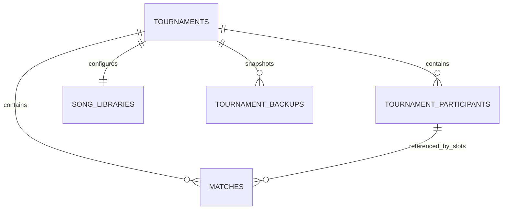

# 赛事数据原生化与集合拆分规划

日期：2026-09-28 · 状态：原始方案，实施路线已调整

用户后续要求直接实施最终分集合结构，取消本文的两步发布路线。实际实现与迁移状态以 [维护手册第 13 节](MAINTENANCE.md#13-atlas-分集合结构schemaversion-3) 为准。本文保留设计讨论，不能作为“尚未实施”或已实现功能的依据。

## 1. 建议与范围

可以拆。建议最终使用 **赛事元信息 + 赛事选手 + 比赛 + 独立私有曲库** 的结构，分两次可独立验收的发布完成：

1. 先把 `body: string` 转为 MongoDB 原生字段，保持单赛事文档及当前版本检查，解决不可直接查询的问题。
2. 再将名册和比赛拆到独立集合，通过事务维护晋级、版本和跨比赛规则；比分、选曲、Ban 仍嵌入所属比赛。

第一步本身已经有效利用 MongoDB，可作为稳定停靠点；第二步是面向多赛事查询和维护的推荐目标。是否立即推进第二步取决于第一步验证结果，不同时改赛制、页面和登录。

这不是把每一个字段都变成一个集合。MongoDB 可以直接查询和更新嵌套对象，嵌套不等于字符串；经常一起读写且数量有界的数据适合保留在同一文档。嵌入模型能保留单文档原子更新，引用模型需要处理跨文档一致性。[MongoDB 数据建模](https://www.mongodb.com/docs/manual/data-modeling/)

**本文件只规划，不执行迁移、写入生产数据、提交或部署。**

## 2. 现状及已有约束

根据当前源码：

- `lib/database.ts` 的 `TournamentRow` 为 `{ id, revision, body: string }`。
- `lib/mongodb.ts` 保存 `{ _id, revision, body }`。名册、比赛及内层 revision 都在序列化字符串内。
- `lib/store.ts` 读取时 `JSON.parse`，保存时 `JSON.stringify`，以 `_id + previous revision` 条件更新整个 body。
- 比赛已有 `match.revision`。旧请求按整届 revision 判断，新请求先判断单场 revision，再尝试整届 CAS，最多重试四次。
- `lib/rules.ts` 不只计算一场分数，还检查其他比赛的已用曲、机台占用，并产生晋级变更。
- `lib/player-management.ts` 修改名册、换人时会使受影响比赛的旧编辑窗口失效。选手原始 seed 与场次位置 seed 不是同一概念。
- `song_libraries` 已经是原生对象，无需再把其内容塞入赛事或公开集合；`sessions.body` 属于认证存储，本次不处理。
- SQLite / D1 是当前本地及兼容适配器；生产是 Atlas。不能让 MongoDB 改造悄悄破坏本地演示和现有测试。

上次操作记录：数据已由 `hachicats` 复制至 `tournaments`，正式赛事键为 `hachicats-20260927`，当时 revision 为 168，旧库保留。**168 是历史核对值，不是本规划可以写入或假设的当前版本。** Vercel 切换状态尚未核实；实施前必须确认哪个库正在接受写入，避免迁移旧快照。

## 3. 方案比较

| 方案 | 查询与更新 | 一致性成本 | 建议 |
| --- | --- | --- | --- |
| 保留字符串 body | 只能先取整段再解析，难以索引内部字段 | 现有单文档 CAS | 不作为长期结构 |
| 原生赛事文档，嵌入 rosters / matches | 可投影、聚合和字段更新，Atlas 可直接查看 | 保留整届单文档原子性 | 第一阶段，独立交付 |
| 元信息、选手、比赛分集合 | 可按赛事 / 分组 / 比赛查询，写入变化文档 | 需要事务及一致性读取 | 推荐目标 |
| 每条分数、每次 Ban 全部拆集合 | 文档和关联查询显著增加 | 事务范围更大，维护复杂 | 暂不采用 |

不能承诺拆集合会自动更快：当前八猫杯只有固定的 48 场，整届读取仍是常用访问方式。应比较查询次数、读取字节数、写入大小、API 延迟、事务重试率；本规划没有生产性能实测。MongoDB 官方也提醒，多文档事务存在额外成本，不能代替合理建模。[事务与建模取舍](https://www.mongodb.com/docs/manual/core/transactions/)

## 4. 第一阶段：去掉 JSON 字符串

目标文档示意（省略业务内容，非迁移命令）：

```js
{
  _id: "hachicats-20260927",
  schemaVersion: 2,
  revision: /* 原有版本原样保留 */,
  updatedAt: /* 原有时间字符串原样保留 */,
  rosters: { /* 原有各组名册 */ },
  matches: [ /* 原有比赛，包括 picks / bans / scores */ ]
}
```

- 将原 `body` 的字段变为 BSON 对象 / 数组 / 数字；不只改为另一个 `body` 对象。
- 外层 revision 成为唯一持久化权威；迁移先验证原外层与 body 内版本一致，不一致就报告并停止。
- 保持现有 ID、顺序、null、零分、胜者、published、缺省 match.revision 的语义及时间字符串。日期转 BSON Date 单独评估，避免同批格式变换。
- 迁移解析原始存储对象，**不通过 `hydrateTournament()` 再保存**：该函数会兼容转换历史指定曲引用，格式迁移不应顺带改写业务数据。
- 保留旧原始字节备份；原生文档用结构比较验证，不能要求新 BSON 和旧 JSON 字节相同。
- 此阶段仍以 `_id + revision` 执行单文档 CAS；可以暂时写整组原生字段，随后优化变化路径。去掉字符串本身不等于已经减少写放大。
- API 仍返回当前 Tournament 结构，客户端和分层 URL 不变。

## 5. 第二阶段：目标集合与字段归属



图表示逻辑关系；MongoDB 不自动替应用维护外键。参赛双方均可为空，服务端必须验证每个非空引用属于同一赛事。

### tournaments：每届赛事一份元信息

| 字段 | 约定 |
| --- | --- |
| `_id` | 路径生成的 `系列-YYYYMMDD`，八猫杯为 `hachicats-20260927` |
| `schemaVersion` | 第二阶段为 3，与业务 revision 分开 |
| `seriesSlug` / `edition` | `hachicats` / `20260927`，与 `_id` 一致 |
| `name` / `date` | 公开展示资料，date 为日期字符串 |
| `format` | 明确赛制标识，例如已有八猫杯单败规则 |
| `revision` / `updatedAt` | 全赛事一致性版本及更新时间 |
| `groups` / `stations` | 组别和机台配置；现有规则仍由八猫杯规则模块执行 |
| `maintenance` | 拟新增的服务端写入阻断状态，所有写入口检查 |

元信息迁至数据库后，目录只读取允许公开的字段；不保留两套可独立编辑的名称 / 日期。代码注册表继续负责受支持页面、规则实现和权限策略，数据库不能自行指定可执行模块或赋予管理权限。仅插入一个赛事文档不会自动得到可用的新赛制。

### tournament_participants：每届赛事每位选手一份文档

建议字段：`_id`、`tournamentId`、`playerId`、`groupId`、`name`、`rating`、`seed`、`rosterOrder`。

- `playerId` 保留现有业务 ID；它是赛事内身份，不强制等于 SSO 用户 ID。
- `_id` 可使用 ObjectId 作为物理键，通过 `(tournamentId, playerId)` 唯一索引保持业务唯一性。API 继续返回旧 playerId；迁移重复运行按该组合定位，不能创建重复选手。
- `rosterOrder` 保留原数组顺序，重置 / 初始排位不能依赖 MongoDB 自然返回顺序。`seed` 保留原初始序号。
- 比赛 a/b 中的 `{id, seed}` 继续保存场次位置；不要用选手文档 seed 覆盖换人后的 slot seed。
- rating 初期保留现有数值类型与最多两位小数校验，不顺带改成整数百分位或 Decimal128。
- 可选 SSO 绑定、跨赛事统一选手档案属于后续需求，不根据姓名自动合并历史选手。

### matches：每届赛事每场比赛一份文档

```js
{
  _id: /* ObjectId，仅为物理键 */,
  tournamentId: "hachicats-20260927",
  matchId: "siamese-r0-0", // 现有业务 ID 原样保留
  group: "siamese",
  round: 0,
  index: 0,
  revision: /* 原有 match.revision，旧缺省值按 0 解释 */,
  a: { id: "siamese-p0", seed: 1 }, // 也可以为 null
  b: { id: "siamese-p1", seed: 2 },
  status: "pending",
  winner: null,
  station: "A",
  published: false,
  picks: [[], []],
  bans: ["", ""],
  scores: [], // { songId, a, b }；只作为结构示例
  updatedAt: null
}
```

`matchId` 不改名、不重新编号；同一个 matchId 可存在于不同赛事。scores 留在比赛文档，既可 `$unwind` 聚合统计，又能与胜者及状态一起提交。当前 API 最多接受 20 个成绩条目，该有界数组不需要独立 score 集合。

名单显示通过参与者映射补全，避免每个历史场次复制姓名 / rating。胜者仍存 playerId。是否冻结历史显示姓名是独立产品决策，本次保持“改名后历史场次显示新名字”的现有行为。

### song_libraries、backups 与其他集合

- `song_libraries` 保持现有原生结构及赛事 `_id`，普通曲目内部 ID、songID、difficultyIndex 和私有 designated 不动。
- 新备份增加 `schemaVersion`，保存可恢复的完整赛事快照（元信息、名册、比赛、版本及生成信息）；旧 body 备份保留，按版本读取。
- 重置快照仍不等于全库备份。曲库变更或结构迁移另存包含曲库的私有快照，明确 manifest 所含集合，避免恢复时误以为已覆盖所有数据。
- `sessions` 与历史 `admins` 不随本轮重构改变；SSO 仍是权限来源。
- 审计事件集合可在后续增加；若实施，记录 actor 稳定 ID、动作、前后 revision、requestId，不记录 token 或公开输出私有曲目。

## 6. 查询、索引与校验

先建满足实际访问方式的索引，不为所有字段建索引：

| 集合 | 索引 | 目的 |
| --- | --- | --- |
| tournaments | `_id`（默认唯一） | 单赛事查找 |
| tournaments | `{seriesSlug: 1, edition: 1}` unique | 防止重复路径 |
| tournament_participants | `{tournamentId: 1, playerId: 1}` unique | 引用、去重 |
| tournament_participants | `{tournamentId: 1, groupId: 1, rosterOrder: 1}` | 分组名册及稳定顺序 |
| matches | `{tournamentId: 1, matchId: 1}` unique | 单场读写 |
| matches | `{tournamentId: 1, group: 1, round: 1, index: 1}` unique | 八猫杯对阵位置及排序；新增赛制需确认是否适用 |
| tournament_backups | `{tournamentId: 1, createdAt: -1}` | 查找恢复点 |

机台 / live 状态和选手历史索引待 explain 与实际调用证明需要后再加。无需给 `_id + revision` 额外建索引，唯一 `_id` 已定位单文档。聚合统计先按 tournamentId 和可见性过滤，再展开成绩，避免跨赛事扫描及泄露草稿。

服务端继续做业务校验；MongoDB `$jsonSchema` 补充字段类型、必填字段、状态枚举和版本范围检查。分阶段启用，先检查存量再强制拒绝无效写入。数据库 schema validator 不能代替跨集合引用、胜者归属、选曲规则或 SSO 校验。实施时按实际 Atlas 服务版本验证语法和能力。

## 7. 写入事务与版本策略

**第一版拆集合仍保留整届 revision 作为提交关卡。** 这样可以维持现有行为，但同一赛事的并发写入仍会在元信息文档上竞争；不能宣称已经实现完全独立的单场并发。

一次保存 / 开赛 / 完赛建议流程：

1. 事务外完成 Origin 和实时 SSO 管理权限检查、请求格式校验；不把外部网络请求放进事务。
2. 事务中读取当前赛事元信息、名册、比赛及所需曲库，检查维护状态和提交版本。
3. 初期重组为现有 Tournament，复用 `applyAction` / `applyPlayerAction`；48 场先读全量保持规则正确，后续才优化依赖查询。
4. 新客户端比较当前 match.revision；旧客户端比较整届 revision。冲突返回 409，不能在重试时修改客户端的期望版本。
5. 计算差异，以赛事 `_id + 原 revision` 更新全局 revision 为 +1，并写入所有受影响的比赛 / 选手。比赛版本继续使用此次全局 revision，保持现有失效语义。
6. 完赛与下一轮双方位置、半决赛与季军赛位置必须同一事务提交；换人、已用曲检查、机台占用和新开赛也必须在同一一致性范围内处理。
7. 事务提交成功后才返回新版本。事务内操作按顺序 await，重试回调不发送消息、写公开日志或执行不可重复的外部副作用。Node 驱动不支持同一事务内并行操作。[驱动事务文档](https://www.mongodb.com/zh-cn/docs/drivers/node/current/crud/transactions/)

全局提交关卡能阻止两场都读到“A 台空闲”后同时开赛的写偏差；仅检查两个不同 match 文档的 revision 不足以做到这一点。如果将来要移除全局关卡，需要另行设计机台占用、选手已用曲、名册版本和晋级目标的并发协调，不纳入第一次拆分。

重置 / 恢复：完整快照成功持久化是前提；同一事务更新所有相关比赛与全局版本，失败全部回滚。所有比赛版本设为新的全局版本以拒绝旧编辑器；恢复内容也用“当前版本 +1”，不能回退业务版本。未知提交结果先重新读取确认，不自动再次执行重置。

## 8. 读取一致性与私有信息

- 第一版跨集合聚合读取使用短的只读 snapshot 事务，避免取到新名册配旧场次或只完成一半的晋级。曲名上游请求在事务之外。
- 后续如改成“读 revision → 读所有集合 → 再读 revision → 不一致重试”，必须确保所有影响响应的写入都遵守同一版本机制，包括曲库，否则不能称为一致快照。
- API 不直接返回 MongoDB 文档；使用明确的公开 DTO 与管理员 DTO，物理 `_id`、内部维护字段和 schemaVersion 不自动暴露。
- 未公布比赛继续隐藏 picks、bans、scores；指定曲仅在 `published=true` 且该场成绩包含指定曲引用时公开。
- 聚合榜单、导出、目录和新查询同样执行可见性规则。不能因为字段“已经拆开”就直接允许客户端读取集合。
- 管理员详情仍经实时 SSO 校验；server-only 边界、no-store 响应和失败时拒绝访问保持不变。SSO 全局身份不代表所有赛事管理权限。

## 9. 代码拆分及本地兼容

建议把 `Database` 的字符串持久化接口逐步提升为类型化的赛事 repository：读取一致状态、提交带 expectedRevision 的变更、备份 / 重置等。业务层不认识 JSON 字符串或 MongoDB session。

| 模块 | 计划变更 |
| --- | --- |
| lib/database.ts、lib/mongodb.ts | 原生类型、schemaVersion 分派；第二阶段加入事务 repository |
| lib/store.ts | 去除业务层 parse/stringify，返回保持兼容的 Tournament |
| lib/tournament.ts | 保留 hydrate 和引用语义，增加持久化映射与公开 DTO 测试 |
| lib/tournament-api/matches.ts、players.ts | 将“读取→规则→提交”移到一致事务边界，保留 HTTP 合同 |
| lib/reset-tournament.ts | 版本化备份与原子重置，覆盖全部场次失效 |
| lib/sql-database.ts | 保持本地序列化存储也可，但实现同一 repository 行为合同 |
| scripts、tests、维护手册 | 分阶段 dry-run / apply / verify / rollback 工具及验收 |

SQLite / D1 不必照搬 MongoDB 集合结构，但不能静默退化为非原子多次写入；可继续在单个 body 中用 CAS 提交整体状态。Atlas 事务能力须在独立测试库验证，仅通过 SQLite 测试不算 MongoDB 验收。

本次不更改 `/hachicats/20260927`、`/api/tournaments/hachicats/20260927/...`、旧兼容接口、SSO 客户端 ID 或比赛业务 ID。

## 10. 迁移、切换与回退

每个阶段分别走以下流程，不把数据库名迁移与结构迁移混作一件事：

1. **确定唯一写入源。** 查实际 Vercel 部署及 MONGODB_DB，只读比较两库当前版本和内容。旧库若继续更新，先解决差异，不能把先前复制结果当最新事实。
2. **准备兼容版本。** 新后端支持该阶段新旧 schema 的读取，写入始终匹配该赛事当前 schema，严禁双写。部署期间仍保持旧 schema；未知版本拒绝处理。
3. **真正停止写入并排空请求。** 维护标志必须先由所有写入口及在运行版本支持；旧函数不认识标志时，必须另行阻断旧服务写入。光在数据库加字段不算暂停。
4. **完整私有备份及演练。** 包含赛事、曲库、名册、备份及索引 manifest；保存原始字节和哈希，权限 600。在隔离库演练恢复。迁移脚本不依赖本地种子或旧 Git 私有配置。
5. **Dry-run。** 验证外内 revision、稳定 ID、重复键、引用、顺序、数据类型及目标冲突；输出计数 / 哈希 / 差异类别，不输出真实曲库或完整成绩。
6. **构建候选并核对。** 第一阶段转换原始 body；第二阶段生成参与者和比赛文档，保留全部业务字段。目标有冲突则停止，不覆盖。
7. **原子切换。** 预先创建集合、索引；事务内再次核对来源版本及必要哈希，写入候选并切换赛事 schemaVersion。大规模赛事若超出事务可承受范围，另设计分批 staging 与 generation 切换，不能悄悄部分提交。
8. **只读验收后解锁。** 对比业务数据、公开 API 和私有边界，确认活动部署使用新 schema，再恢复写入。旧字段只保留在私有备份，不让其成为第二份可写来源。
9. **记录迁移状态。** 迁移 ID、from/to schema、赛事 ID、源版本、计数、校验结果和时间可记录；重跑已完成迁移只验证，部分失败先检查实际状态。

回退分两种：尚未恢复业务写入时，可以从迁移前快照还原结构；恢复写入以后必须从最新状态反向转换，不能拿旧快照覆盖新比分。代码回退必须选择兼容当前 schema 的版本。业务恢复仍递增版本；schema 转换本身不修改比赛 revision。

## 11. 验收标准与交付顺序

### 必须通过的验收

- 选手 ID、比赛 ID、曲目内部 ID、songID / difficultyIndex、比分（含 0 / null）、胜者、晋级、公开状态、顺序和 revision 完全保持；原缺省字段按兼容语义检查。
- 同场并发仅一方成功；不同场保存按既有语义重试；同时争抢机台只能一方开赛；换人、改资料、晋级、重置使受影响编辑器失效。
- 在晋级写入一半、备份失败、事务重试、网络中断等情况下验证回滚和重新读取行为；不出现“比分已确认但下一轮为空”。
- 匿名、普通用户、撤权用户、SSO 故障、跨赛事请求均不泄露私有曲目；保留全部指定曲公布组合与浏览器依赖图测试。
- 迁移缺少曲库、版本不一致、重复目标、引用缺失、重跑、回退、旧库新写入等场景有隔离测试。
- 原生查询及拆集合后仍兼容当前接口；数据大小、读取字节、查询次数、API 延迟及事务重试率有前后记录，再决定优化优先级。
- 运行相关现有测试、typecheck、生产构建，加独立 Atlas 集成测试；不通过修改真实比赛验收。

### 建议分四个可评审交付

| 交付 | 内容 | 完成标志 |
| --- | --- | --- |
| A | 类型化 repository、schema 兼容、原生字段迁移工具 | 隔离演练和第一阶段验证通过 |
| B | 第一阶段受控迁移与应用切换 | body 字符串退出活动赛事记录，现有行为不变 |
| C | participants / matches 集合、事务、索引、快照读取 | 第二阶段在隔离库完成并发及回退演练 |
| D | 第二阶段生产迁移、只读验收及性能记录 | 数据一致、接口兼容、旧编辑器保护有效 |

默认采用这个路线。无需先引入 ORM、分片、Change Streams、全局选手系统或全量事件溯源；出现具体需求和测量证据后再安排。审批本规划并不表示上述步骤已经执行。
